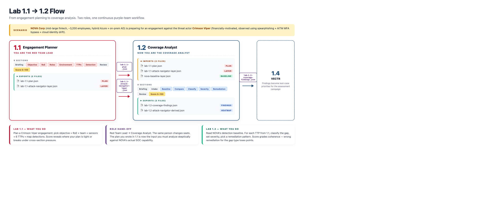

# Lab 1.2 — Coverage Analyst Challenge

## What this lab is

You just finished Lab 1.1 wearing the **Red Team Lead** hat. You handed off your engagement plan — a JSON file with the TTPs Crimson Viper is going to throw at NOVA Corp. Now you change seats.

You are the **Coverage Analyst** at NOVA. The plan from Lab 1.1 just hit your desk. Your job is to read it with healthy skepticism, map every priority TTP against NOVA's **actual** detection baseline (the one your SOC is really running, not the one in the slide deck), classify each gap honestly, calibrate severity given what NOVA actually cares about (PCI scope, crypto custody, AD Tier 0), and pick a coherent remediation pattern for every real gap — without burning the SOC's quarterly budget on cosmetic fixes.

The goal of the lab is not to plug every hole. It is to make the same trade-offs a real Coverage Analyst makes when Red Team's "we'll need detection for everything" meets Blue Team's "we have three engineers and a roadmap."

## How the two labs connect

Lab 1.1 exports `lab-1.1-plan.json`. Lab 1.2 imports it in Section 1 — Intake.

- **If you import your plan:** the TTPs *you* picked in Lab 1.1 become the technique list you grade against NOVA's baseline. Your planned detections (from Lab 1.1's Section 9) feed into cross-coherence scoring — if you planned to lean on a control that the baseline says doesn't actually exist, the lab will catch it.
- **If you skip the import:** the lab falls back to the canonical Crimson Viper TTP set so it still runs standalone. A small penalty applies because you are now being graded against the canonical set instead of your own plan.

The throughline is real, not cosmetic. You feel the consequences of Lab 1.1 decisions in Lab 1.2 scoring.

## How to run it

1. Download **`lab-1.2.zip`** from this folder and unzip it anywhere on your machine.
2. Open **`coverage-analyst-v2.html`** in any modern browser (Chrome, Firefox, Edge, Safari). Double-click works — no install, no backend, no account.
3. When the lab asks for the Lab 1.1 plan, point it at the `lab-1.1-plan.json` you exported from the previous lab. If you don't have it, click "Use canonical TTP set" to continue.
4. Your progress auto-saves to the browser. Closing the tab is safe; reopening the same browser restores your work.

The zip contains the two files the lab needs: the HTML and `nova-baseline-layer.json` (the pre-built NOVA detection baseline as an importable ATT&CK Navigator layer). Keep both files in the same folder.

## What you will do

The wizard walks you through 9 sections. You can revisit any of them at any time using the left-hand navigation:

1. **Briefing** — read the Coverage Analyst mission and the connection back to Lab 1.1.
2. **Intake** — import the Red Team plan from Lab 1.1 (or accept the canonical fallback set).
3. **NOVA Detection Baseline** — review the 21-TTP baseline NOVA is actually running today: what is fully covered, what is logged-but-not-alerted, what is unmonitored.
4. **Compare in Navigator** — instructions to open both layers (your Lab 1.1 plan layer + the NOVA baseline layer) side-by-side in MITRE ATT&CK Navigator to see overlap visually before classifying.
5. **Classify Gaps** — for each priority TTP, pick its real coverage status (none / logged-only / weak-alert / partial / adequate / strong). This is the largest scoring section.
6. **Severity & Business Impact** — calibrate severity per TTP. Crown-jewel TTPs (cloud identity, ransomware, Kerberos / Tier 0) have a severity floor — the lab will let you go below it, but it will cost you.
7. **Remediation Patterns** — pick a coherent fix per real gap: new Sigma rule, tune existing, new Suricata signature, new EDR rule, onboard log source, compensating control, or accept the risk. Mismatched patterns (e.g., "no coverage" gap + "tune existing rule") are penalized.
8. **Pre-Score Review** — last chance to revise before scoring.
9. **Scorecard & Exports** — verify your work, then export.

## Tabletop injects

Three real-world curveballs auto-fire as you progress through the lab (drawn from a pool of six, so two students sitting next to each other may not get the same three). They simulate things that actually happen: a CISO budget cut mid-quarter, a fresh MISP intel drop, a PCI auditor request, Red Team pushback on your ratings, SOC capacity constraints, CTI drift. Each inject is worth ±5 points depending on how you handle it. Read carefully and revise the affected sections if your analysis needs to adapt.

## What you will produce

When you reach the Scorecard section, you will be able to download:

- A **findings JSON** of your complete coverage analysis (this becomes the input for Lab 1.4 — VECTR test-case prioritization).
- A **MITRE ATT&CK Navigator layer** derived from your gap classification — each TTP scored by coverage strength so you get a visual heatmap of NOVA's detection posture against Crimson Viper.
- A **PDF** of the full analysis via your browser's Print function.

Save these files. You will need them for Lab 1.4.

## Tips before you start

- **Be honest, not optimistic.** A rule that fires with 84% false positive rate is not "adequate" — it is `weak-alert`. The scorecard knows the difference.
- **Crown jewels carry weight.** Anything touching cloud identity (T1078.004, T1098.001, T1567.002), ransomware impact (T1486), or Kerberos / Tier 0 (T1558.003, T1078) should be at minimum **High** severity. Under-rating these is the single most common way to lose points.
- **Match the remediation to the gap.** "No coverage" cannot be fixed by tuning a rule that does not exist. "Weak alert" cannot be fixed by onboarding a log source that is already there. The lab grades coherence, not effort.
- **`accept-risk` is a real option** — for TTPs that are genuinely out of scope for NOVA (containers, macOS, firmware). Using it on a crown-jewel gap is a coherence penalty.
- **Treat soft validation as a hint, not a gate.** The lab will warn you about incomplete fields but will not stop you from exporting. You are the practitioner; you decide what is "done."

## Estimated time

45 minutes for an experienced practitioner. Take longer if you want to think it through — the lab does not penalize time spent.
